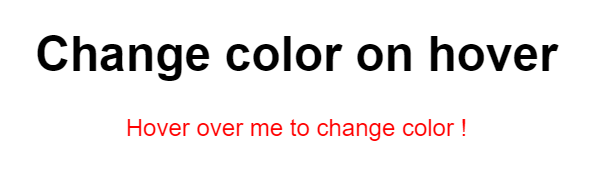

# Hover-Color-Change-with-jQuery

## Description
This web page demonstrates a simple interaction where the color of a text changes when the user hovers over it. The page uses HTML, CSS, and jQuery to achieve this functionality. The design is minimal and centered, providing a clean and interactive experience.

### Components:

1. **HTML Structure**:
    - **Heading**: A header (`<h1>`) titled "Changer la couleur au survol".
    - **Paragraph**: A paragraph (`
`) with the ID `#hover` which changes color on mouse hover.

2. **CSS Styling**:
    - The page uses a clean, centered design with a default color for the paragraph text.
    - Text and buttons are styled to be visually clear and easy to interact with, with padding and margins for spacing.

3. **JavaScript (jQuery)**:
    - **Document Ready**: Ensures the jQuery code runs only after the document is fully loaded.
    - **Hover Event Handlers**: 
        - `mouseenter` event changes the text color to red when the mouse pointer is over the text.
        - `mouseleave` event changes the text color back to black when the mouse pointer leaves the text.

### Features:
- **Interactive Hover Effect**: Users can see the color of the text change dynamically as they hover over it.
- **Smooth Transitions**: Color changes are immediate, providing a responsive interaction.
- **User-Friendly Interface**: Simple and intuitive design for easy interaction.

### Usage:
- **Hover Over Text**: Move the mouse pointer over the text "Survolez-moi pour changer de couleur !" to change its color to red.
- **Move Away**: Move the mouse pointer away from the text to change its color back to black.

This example provides a simple and engaging way to demonstrate jQuery's event handling capabilities for dynamic style changes on a web page.
